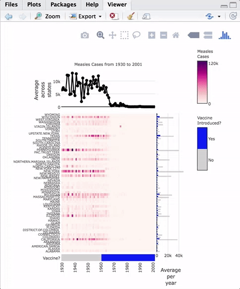

[](https://travis-ci.org/)
[](https://codecov.io/github/?branch=master)

# iheatmapr

iheatmapr is an R package for building complex, interactive heatmaps using modular building blocks. "Complex" heatmaps are heatmaps in which subplots along the rows or columns of the main heatmap add more information about each row or column. For example, a one column additional heatmap may indicate what group a particular row or column belongs to. Complex heatmaps may also include multiple side by side heatmaps which show different types of data for the same conditions. Interactivity can improve complex heatmaps by providing tooltips with information about each cell and enabling zooming into interesting features. iheatmapr uses the [plotly](https://plot.ly) library for interactivity. 

## Example Complex Heatmap

As an example of a complex heatmap, we can make a version of the famous vaccines plot from the Wall Street Journal that has been recreated in several other heatmap frameworks in R. 



The code to create this heatmap is:

```R
library(iheatmapr)
data(measles, package = "iheatmapr")

main_heatmap(measles, name = "Measles<br>Cases", x_categorical = FALSE,
             font = list(size = 8)) %>%
  add_col_groups(ifelse(1930:2001 < 1961,"No","Yes"),
                  side = "bottom", name = "Vaccine<br>Introduced?",
                  title = "Vaccine?",
                  colors = c("lightgray","blue")) %>%
  add_col_labels(ticktext = seq(1930,2000,10),font = list(size = 8)) %>%
  add_row_labels(size = 0.3,font = list(size = 6)) %>% 
  add_col_summary(layout = list(title = "Average<br>across<br>states"),
                  yname = "summary")  %>%                 
  add_col_title("Measles Cases from 1930 to 2001", side= "top") %>%
  add_row_summary(groups = TRUE, 
                  type = "bar",
                  layout = list(title = "Average<br>per<br>year",
                                font = list(size = 8)))
              
```

Modular components of the plot are added in an iterative fashion to the top, right, left, or bottom of the heatmap. iheatmapr also contains a function (`iheatmap`) to make a fairly standard heatmap with optional dendrograms and row or column annotation heatmaps (See vignette).  

All the plots aligned with the main heatmap horizontally share the same y axis and thus zooming in the y direction within the heatmap will also zoom in to those subplots. The plots aligned vertically share an x axis with that heatmap and zooming horizontally within those plots will be linked.  

Hovering over the heatmaps yields a tooltip with the name of the row and column as well as the value represented.

# Documentation

See the vignette for a more thorough introduction to the package.
